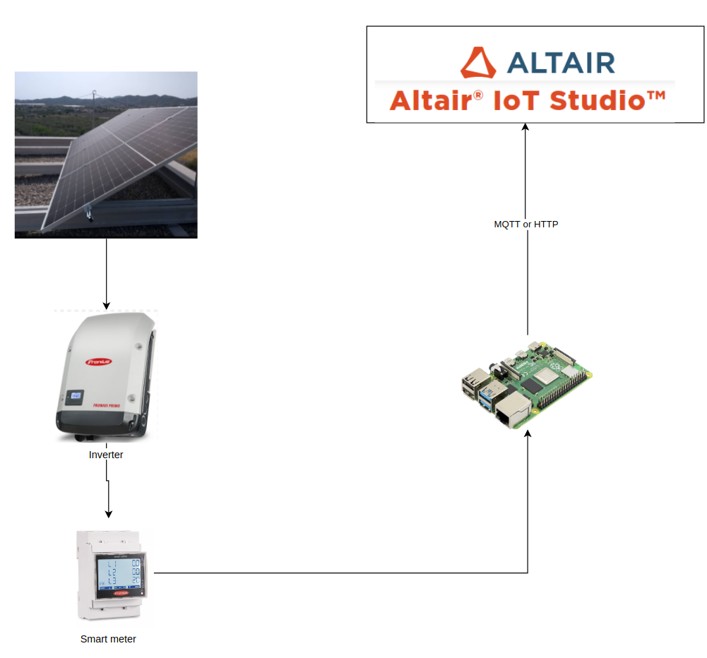

# 🌞 IoT Studio Challenge: Connected Photovoltaics Power Plant 🌍

## Team

- Francisco Franco 🚀
- David Garcia 🔧

## Project Overview

Welcome to the IoT Connected Photovoltaic (PV) Power Plant project! This initiative is all about integrating a solar power plant's monitoring system with the Altair® IoT Studio™ platform. 
The goal? To bring you real-time visuals of the plant’s performance and provide rich datasets for deep dives and analytics. By hooking up the solar power plant to Altair® IoT Studio™,
you'll be able to monitor and analyze various performance parameters continuously, boosting the plant's operational efficiency and maintenance routines. 🌟

### Metrics We Track

Here's what we measure to keep the PV plant in top shape:

- **⚡ Voltage and Current**: Keep tabs on electrical parameters to ensure everything's running smoothly.
- **🌡️ Temperature**: Monitor ambient and panel temperatures to prevent overheating.
- **☀️ Irradiance**: Measure the solar energy received to check the plant's energy conversion efficiency.
- **🔋 Energy Production**: Track the total energy generated over time.
- **📊 System Efficiency**: Calculate the ratio of actual energy output to potential output under ideal conditions.

### What You Get

By gathering and crunching these numbers, we create a digital twin of the PV plant. This gives us:

- **📈 Performance Trends**: Long-term analysis of the plant’s output and efficiency.
- **🔍 Predictive Maintenance**: Spot issues before they cause trouble.
- **🚀 Optimization Opportunities**: Find areas for performance and efficiency improvements.
- **🌿 Environmental Impact**: Measure the plant’s contribution to sustainability and its carbon footprint.

This treasure trove of info helps make smarter decisions and ensures the solar power plant runs at peak performance.

## Design Blueprint

To make this happen, the solar power plant is kitted out with a slick data acquisition system that collects data from a bunch of sensors and meters. 
This system talks to a gateway device, like a Raspberry Pi, which connects to the internet. The gateway then sends the data to the IoT Studio platform,
letting you visualize and analyze the plant's performance metrics in real-time. 🖥️

## How We Did It

We use a Raspberry Pi to run Python scripts that chat with the power meter. These scripts gather data, process it, and then upload it to the Altair® IoT Studio™ platform.
The data is sent using either MQTT or HTTP protocols, ensuring smooth and reliable communication for real-time monitoring and analysis.

The dashboard? That’s built in Panopticon Visualization to give you real-time visuals of all the collected data. 🚀

## What You Need

- **Raspberry Pi**: This little powerhouse runs the Python script and handles the internet connection to upload data to IoT Studio.

---

Dive into the repository and help us make the IoT Connected Photovoltaic Power Plant project even more awesome! Your feedback and contributions are super welcome! 🎉

---

## License

This project is licensed under the MIT License - see the [LICENSE](LICENSE) file for details.

## Shoutouts

Huge thanks to all the contributors and the IoT Studio team for their support and collaboration. 🙌

---

[Explore the GitHub Repository](https://github.com/ethcero/Altair-IoT-challenge-Connected-PV) 🚀
