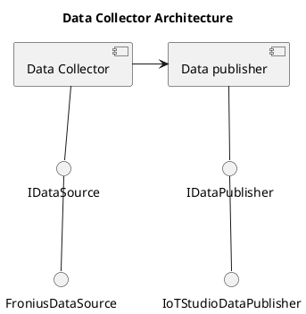

# Design

The `Data Collector` module is tasked with gathering data from a specified data source and subsequently transmitting it to the `Data Publisher`. It is designed to conform to the `IDataCollector` interface. In the context of the Fronius inverter, the data source is represented by the Fronius API, while the data publisher is the IoT Studio API.

This UML diagram illustrates the interaction between the different components. The `Data Collector` interacts with both the `Data Source` and the `Data Publisher`. The `Data Source` is implemented by `FroniusDataSource` and the `Data Publisher` is implemented by `IoTStudioDataPublisher`.